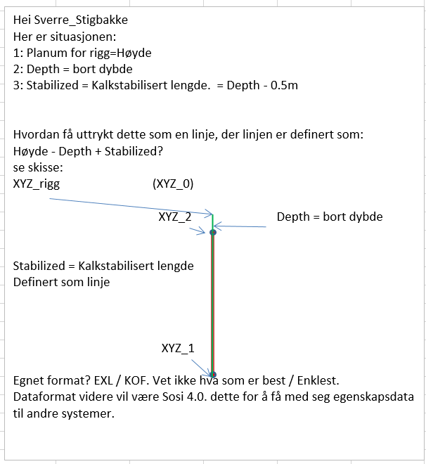

# riggmatch2sosi

Lager SOSI-fil ved å kombinere data fra csv-fil og KOF-fil. Csv-fil har data om boredybde fra borerigg. KOF-fil har posisjonsdata for toppen av kalk-pel som er satt ned i borehullet.

